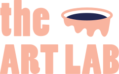

## The Art Lab Korea ?

_현대미술과 예술교육의 실험적 혁신 프로젝트_

### 더아트랩 소개

* 단체명칭 : 더아트랩 / The Art Lab _Korea_
* 더아트랩은 대구지역을 중심으로 한 4명의 현대미술 작가들로 구성된 그룹입니다.
* 문화 및 예술 관련 전문가로 구성된 단체로서 연구 등을 목적으로 하며, 문화 예술의 지속적 발전과 예술 창조 및 표현활동에 매진합니다.
* 또한 예술교육 환경의 탐색을 통해 지역문화 예술교육에 기여합니다.
* 나아가 다양한 예술 분야에 원활한 소통과 교류를 목적으로 만들어진 단체입니다.
* 여러 아동 미술기관의 전문가들이 모여 만든 단체로 새롭고 혁신적인 다양한 교육 프로그램 개발을 목적으로 연구하고 실행해가고 있는 중입니다.

------

## Members

|번호 |이름   |소속  |주요활동  |
|-----|-------|------|----------|
|1    |송선영 |대구교육대학교 미술영재교육원  미술영재교육원  신조미술협회  청백여류회가회  더아트랩 (대표)|**미술영재교육원**  교육부장(2008~현재)  영재원 전반적인 운영계획 및 영재 지도, 전시회 기획, 관리 등 **신조미술협회**  총무(2010~현재)  신조미술협회 재정관리, 전시기획, 운영, 50주년 기념 사업 전시 진행 등 **청백여류화가회**  총무, 회장 역임  40주년 기념 사업 기획, 추진, 진행|
|2 |김조은 |대구예술영재교육원  대구현대미술가협회  영남한국화회  수성미술가협회  가톨릭미술협회  더아트랩|**미술영재강사** **영남한국화회**  사무국장(2017~현재) **대구현대미술가협회**  홍보분과위원(2018~현재)|
|3    |장윤정 | 안녕 포레스트 (아동미술전문교육원)  더아트랩 | **안녕 포레스트**  대표(현재)  자연융합 현대 아동 미술교육 프로그램 연구‧개발  미술교육원 기획‧운영 |
|4    |하혜민 | 대구학생문화센터  창작아카데미  더아트랩 | **대구과학관**   체험형 프로그램, 어린이 체험형 기획전 기획 및 전시  **출강** :  백석문화대학, 예술의 전당, 대구학생문화센터 창작아카데미, 대구교육대학교 영재교육원등 다수  **정부지원사업 운영**  \- 경상북도교육청 : 맞춤형 미술교육사업 \- 국민건강보험공단 :  청소년 흡연 예방사업  \- 대구시청주관 :  사랑 나눔 멘토링 사업  \- 대구시청 :  청소년 재능지원 사업 |

------

## History

|날짜             |활동               |
|-----------------|-------------------|
|2022.12~2023.01 |문화취약지역 문화예술교육 지원사업 : Let's play Art!! |
|2022.07.30~08.31 |하빈pmz평화예술센터 연:결하다展 |
|2022.07.01~08.26 |서구교육지원청 초대전 (조은향기展) |
|2022.09.18       |제4회 더아트랩 어린이 미술체험 프로그램 실시 |
|2022.07.03       |제3회 더아트랩 어린이 미술체험 프로그램 실시 |
|2022.06.19       |제2회 더아트랩 어린이 미술체험 프로그램 실시 |
|2022.05.15       |제1회 더아트랩 어린이 미술체험 프로그램 실시 |
|2022.04.01       |고유번호증 발급 |
|2022.03          |단체 설립 |
|2020.06~12       |움직이는 미술관 (대구광역시 초·중등학교 60개교 출강) |

------

## Logo

|기본형 |웹용 애니메이션 |
|-------|----------------|
|  |  |

* [theartlab_logo.svg](../assets/images/theartlab_logo.svg)
* [theartlab_logo_h50.png](../assets/images/theartlab_logo_h50.png) / [theartlab_logo_h70.png](../assets/images/theartlab_logo_h70.png) / [theartlab_logo_h100.png](../assets/images/theartlab_logo_h100.png) / [theartlab_logo_h150.png](../assets/images/theartlab_logo_h150.png)
* [theartlab_logo_h200.png](../assets/images/theartlab_logo_h200.png) / [theartlab_logo_h300.png](../assets/images/theartlab_logo_h300.png) / [theartlab_logo_h600.png](../assets/images/theartlab_logo_h600.png)

------

## Contact

* 이메일 :  theartlabkorea@gmail.com
