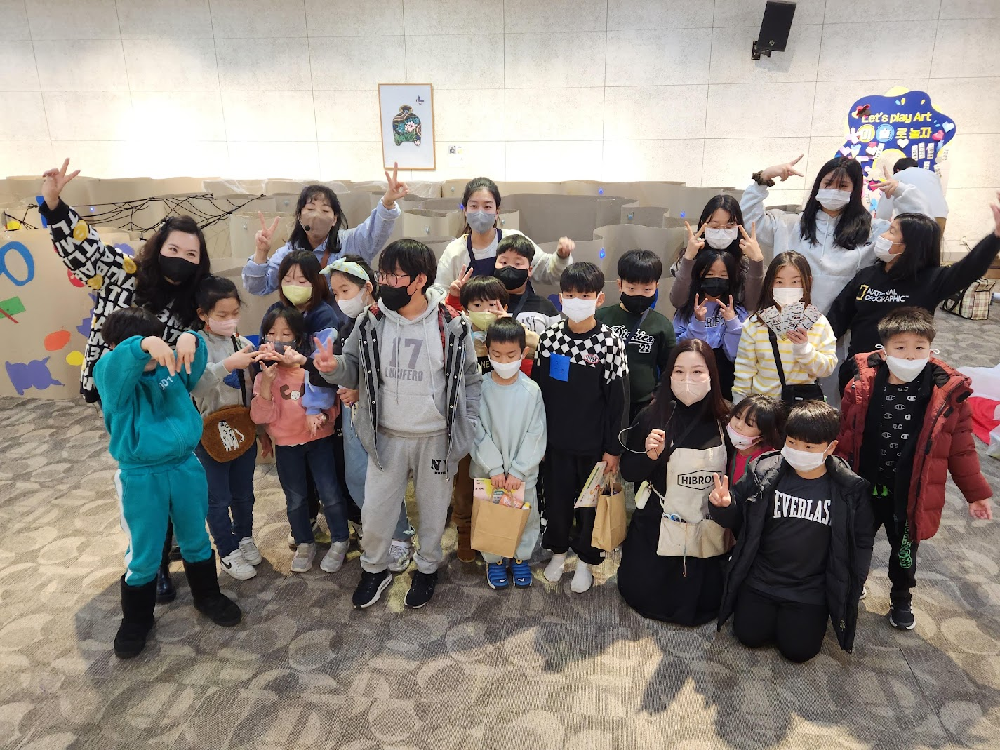

## 개요
* 2022 문화취약지역 문화예술교육지원사업
* 명칭 : '고령다문화' 친구들과 함께하는 Let's Play Art - 오색찬란 아트페스티벌 "빛으로 물들다"
* 날짜 : 2023.01.08
* 장소 : 고령대가야 문화누리
* 주최 : 문화체육관광부
* 주관 : 한국문화예술회관연합회 (KoCACA)
* 수행 : 더아트랩(The Art Lab Korea)

